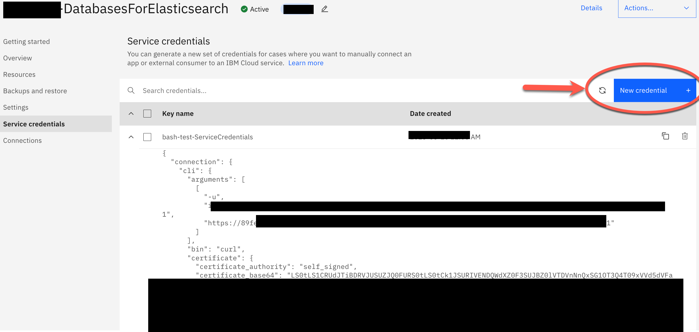

# Example of how to connect and use Elasticsearch on IBM Cloud Databases using bash automation and CURL commands

Example how to connect to [Elasticsearch](https://www.elastic.co/) on IBM Cloud with [Databases for Elasticsearch](https://cloud.ibm.com/databases/databases-for-elasticsearch) using bash scripting with cURL.

**Content:**

* Setup
* Example usage of search indexes using bash automation
* Elasticsearch example CURL search command

**Useful resources:**

* [Elasticsearch API documentation](https://www.elastic.co/guide/en/elasticsearch/reference/current/indices-create-index.html) here you can easily copy the commands
* [IBM Cloud Elasticsearch `CURL` documentation](https://cloud.ibm.com/docs/databases-for-elasticsearch?topic=databases-for-elasticsearch-connecting-curl)

## 1. Setup

### Step 1: Clone the repo to the local machine

```sh
git clone https://github.com/thomassuedbroecker/example-connect-to-elastic-search
cd example-connect-to-elastic-search
```
### Step 2: Create a `Standard` Eleasticsearch instance on IBM Cloud

```sh
open https://cloud.ibm.com/databases/databases-for-elasticsearch/create
```

### Step 3: Create new Service Credentials



### Step 4: Download the self-signed certificate to your local computer

Download the certificate into the folder ./code/cert.

### Step 5: Create a .env file for environment variables of the bash automation

```sh
cat code/.env_template > .env
```

### Step 6: Insert the needed values for the environment variables

```sh
# IBM Cloud
export IBM_CLOUD_API_KEY=XXXX
export IBM_CLOUD_REGION=us-south
export IBM_CLOUD_RESOURCE_GROUP=default

# Elasticsearch service
export E_SEARCH_SERVICE=YOUR_DatabasesForElasticsearch
export E_CERT_FILE_NAME=d5290bfc-XXXXX-XXX-9337-XXXX40bd
export E_HOST=XXXXX-XXXXX-XXXXX-XXXXX.XXXX.databases.appdomain.cloud
export E_PORT=0815
export E_ADMIN_USER=admin
export E_ADMIN_PASSWORD=YOUR_AWESOME_PASSWORD
```

### Step 7: Change the admin password for the database

```sh
cd /code
sh change_admin_password.sh
```

* Example output:

```sh
Key                   Value
ID                    crn:XXX
Deployment ID         crn:vXXX
Description           Updating user
Created At            2023-XX
Status                running
Progress Percentage   0
                      
Status                completed
Progress Percentage   100
Location              https://api.us-east.databases.cloud.ibm.com/XXXX
OK
```

## 2. Example usage of search indexes using bash automation

### Step 1: Test the connection

```sh
cd /code
sh test_connection.sh
```

* Example output:

```sh
{
  "cluster_name" : "XXX",
  "status" : "green",
 ...
}
```

### Step 2: Create indexes

```sh
cd /code
sh create_indexes.sh
```

### Step 3: Upload data to index

```sh
cd /code
sh upload-data_to_indexes.sh
```

### Step 4: Search in index

```sh
cd /code
sh search_in_indexes.sh
```

### Step 5: Delete indexes

```sh
cd /code
sh delete_indexes.sh
```

## Elasticsearch example CURL search command

### Step 1: Open a terminal

### Step 2: Create a folder called cert

```sh
mkdir cert
```

### Step 3: Navigate to the folder 

```sh
cd cert
```

### Step 4: Set the environment variable path 

```sh
export E_CERT_PATH=$(pwd)
```

### Step 5: Download the certificate file for your [Databases for Elasticsearch](https://cloud.ibm.com/databases/databases-for-elasticsearch) instance 

Download it to your local computer into the newly created folder.


### Step 5: Set the following environment variables to your values

* Example:

```sh
export E_CERT_FILE_NAME=d5290bfc-XXXXX-XXX-9337-XXXX40bd
export E_HOST=XXXXX-XXXXX-XXXXX-XXXXX.XXXX.databases.appdomain.cloud
export E_PORT=0815
export E_ADMIN_USER=admin
export E_ADMIN_PASSWORD=YOUR_AWESOME_PASSWORD
```

### Step 6: Execute an index search

```sh
CURL_CA_BUNDLE=$E_CERT_PATH/$E_CERT_FILE_NAME curl -u ${E_ADMIN_USER}:${E_ADMIN_PASSWORD} -XGET -H "Content-Type: application/json" "https://${E_HOST}:${E_PORT}/documents/_search" -d '{ "query": {"multi_match" : {"query" : "Second Hello World?","fields": ["title", "text"]}}}' | jq '.'
```


